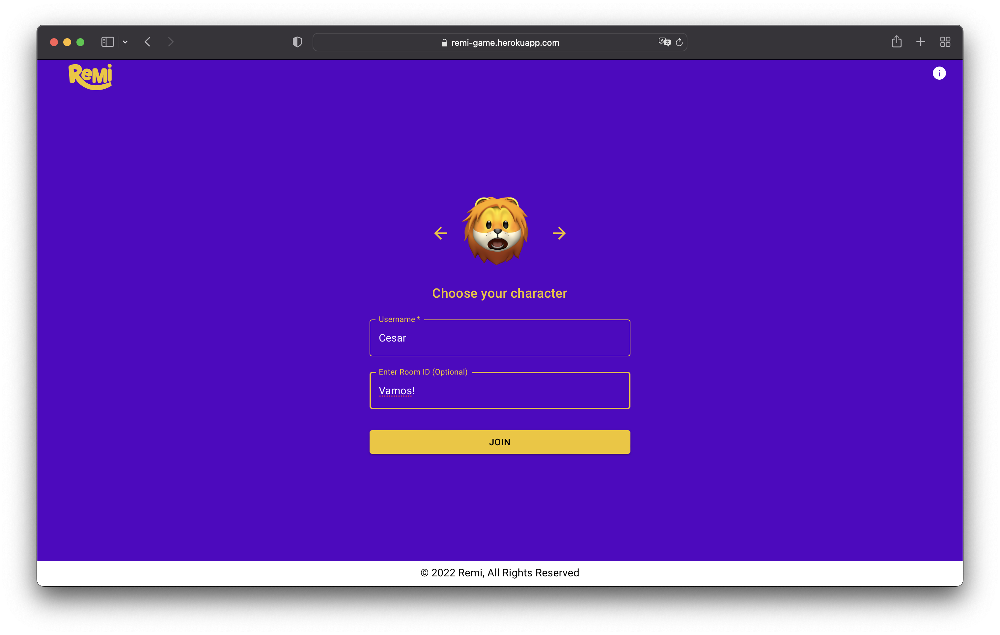
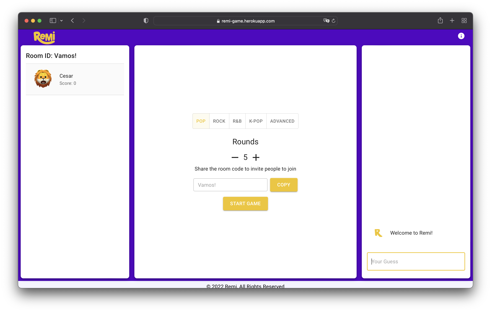

# Remi Trivia Game
Remi is a music trivia single/multiplayer game using the Spotify API!

**Link to project:** https://remi-game.herokuapp.com/

## How It's Made:

**Tech used:** React, Express , Spotify API, Socket.io

I'm not much of a gamer but I wanted to add a project to portfolio that was colorful and fun! I jumped into Adobe Illustrator and Photoshop to get a logo design that I could make my center piece to work around. Once I had the concept down I began starting on the code. I researched a lot on how I could implement the Spotify API as well as connecting users so they could chat and connect to game lobbies. Socket.io made this incredibly easier since it doesn't take much to get started with it. 

## Optimizations

There a quite a few optimizations that I would like to add in order to improve the overall user experience. 
  - Making it more mobile friendly.
  - Improving guessing feature.
  - Maybe improve the layout of the game.

## Dependencies
### Client:
- Socket.io - client
- Axios

### Server:
- Axios
- Body Parser
- Dotenv
- Express
- Nodemon
- Socket.io

## Getting Started
Install dependencies using the npm install command within each client/server folders.

- Start the client web server using the npm start local command within the client folder. The app will be served at http://localhost:3000/.

- Start the server using the npm start local command within the server folder Go to http://localhost:8000/ in your browser.

